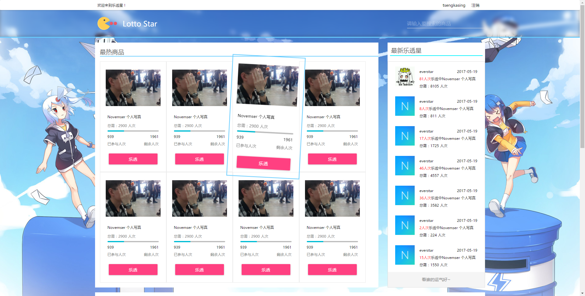
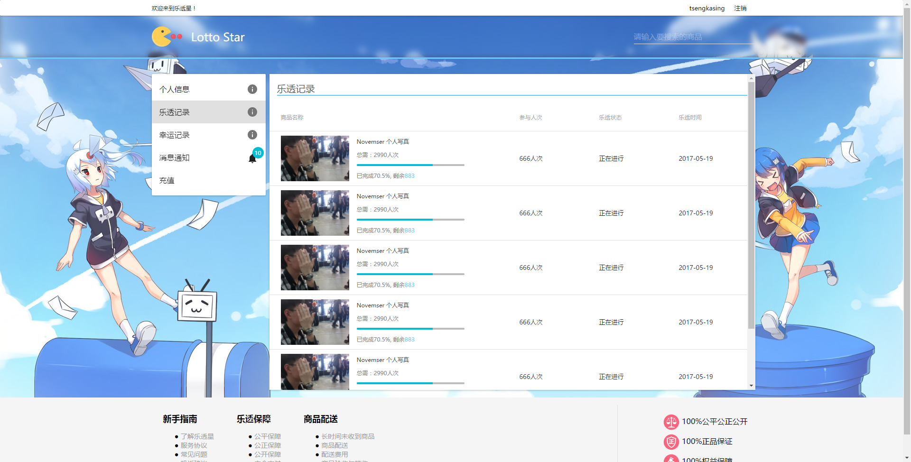
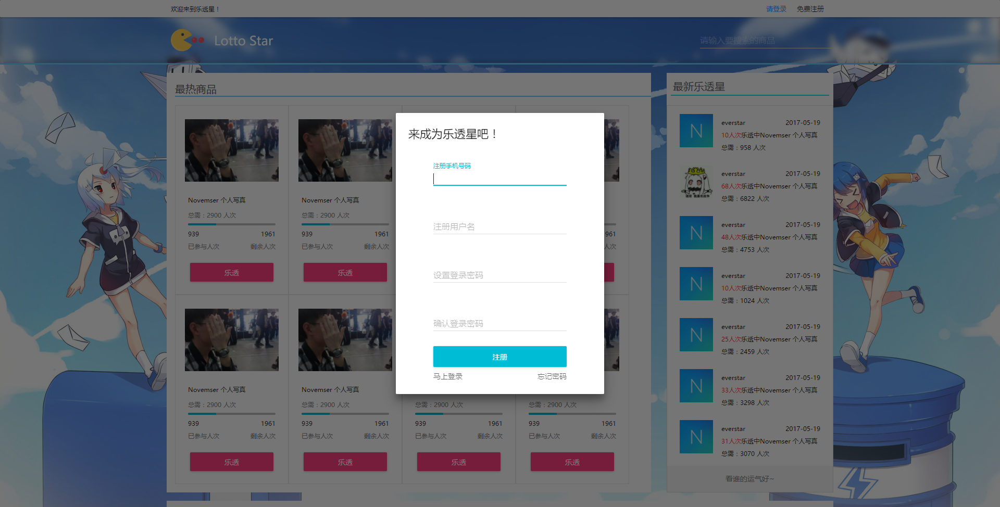

# LottoStar
LottoStar is a lottery buying website. Built with react & .Net.

But this repository only hold the front end part.


## Usage

It's recommended using cnpm to install packages faster in China.

```powershell
npm install
npm start
```


The Proxy setting is in ``package.json`` file

```
{
	"proxy": "http://novemser.vicp.io:523/"
}
```


## Snapshots





